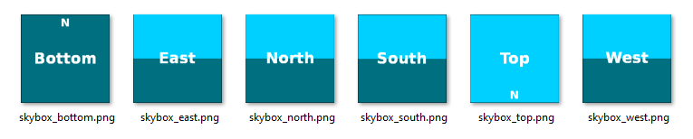
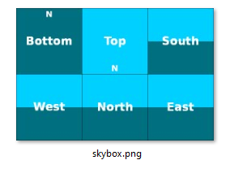
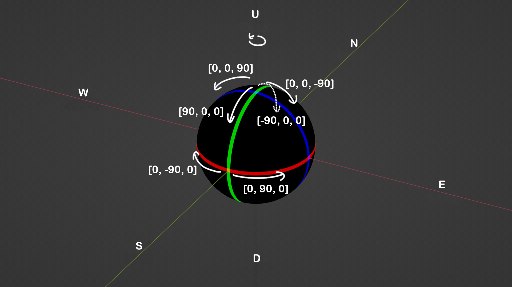
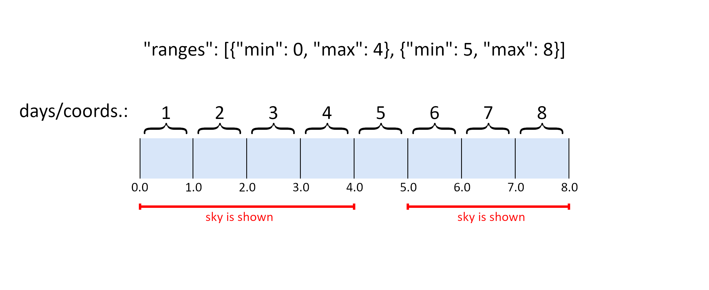

# Fabric skyboxes specification

This specification defines a format for a set of rules for the purpose of custom sky rendering. These rules can be categorized into 10 groups. See the side panel for the table of contents.

There are going to be examples along the way, and at the very bottom of the page, there are going to be full examples of the different types of skyboxes to showcase the structure of a complete file, as well as template files to help you to quickly start your own pack.

## 1. Schema version

The current version is 2.

```
"schemaVersion": 2
```

## 2. Type

There are 3 main types of skyboxes: monocolor skyboxes, textured skyboxes and vanilla skyboxes.

### 2.1 Monocolor skyboxes

<table><thead><tr><th width="240" align="center">Name</th><th align="center">Description</th></tr></thead><tbody><tr><td align="center"><code>monocolor</code></td><td align="center">Shows a single plain color for the full skybox.</td></tr></tbody></table>

```
"type": "monocolor"
```

### 2.2 Textured skyboxes

<table><thead><tr><th width="374" align="center">Name</th><th align="center">Description</th></tr></thead><tbody><tr><td align="center"><code>square-textured</code></td><td align="center">uses 6 separate 1:1 aspect ratio texture files for the 6 sides of the skybox</td></tr><tr><td align="center"><code>animated-square-textured</code></td><td align="center">uses multiple sets of 6 separate 1:1 aspect ratio texture files for an animated skybox</td></tr><tr><td align="center"><code>single-sprite-square-textured</code></td><td align="center">uses a single 3:2 aspect ratio texture file for the skybox</td></tr><tr><td align="center"><code>single-sprite-animated-square-textured</code></td><td align="center">uses multiple single 3:2 aspect ratio texture files for an animated skybox</td></tr></tbody></table>

```
"type": "single-sprite-square-textured"
```

Example for `(animated-)square-textured` skybox

<figure><figcaption></figcaption></figure>

Example for `single-sprite-(animated-)square-textured` skybox

<figure><figcaption></figcaption></figure>

### 2.3 Vanilla skyboxes

<table><thead><tr><th width="211" align="center">Name</th><th align="center">Description</th></tr></thead><tbody><tr><td align="center"><code>overworld</code></td><td align="center">This will show the overworld's skybox.</td></tr><tr><td align="center"><code>end</code></td><td align="center">This will show the end's skybox.</td></tr></tbody></table>

```
"type": "overworld"
```

## 3. Color

This should only be used- and must be used when using the `monocolor` type of skybox.

<table><thead><tr><th width="126" align="center">Name</th><th align="center">Description</th><th width="108" align="center">Required</th><th width="100" align="center">Default</th></tr></thead><tbody><tr><td align="center"><code>red</code></td><td align="center">Specifies the amount of red color to be used. Must be a value between 0 and 1.</td><td align="center">✅</td><td align="center">-</td></tr><tr><td align="center"><code>green</code></td><td align="center">Specifies the amount of green color to be used. Must be a value between 0 and 1.</td><td align="center">✅</td><td align="center">-</td></tr><tr><td align="center"><code>blue</code></td><td align="center">Specifies the amount of blue color to be used. Must be a value between 0 and 1.</td><td align="center">✅</td><td align="center">-</td></tr><tr><td align="center"><code>alpha</code></td><td align="center">Specifies the amount of alpha transparency to be used. Must be a value between 0 and 1.</td><td align="center">❌</td><td align="center"><code>1.0</code></td></tr></tbody></table>

```
"color": {"red": 0.84, "green": 0.91, "blue": 0.72, "alpha": 1.0}
```

## 4. Texture

This should only be used- and must be used when using the 2 NON-animated skybox types.

<table><thead><tr><th width="139" align="center">Name</th><th align="center">Description</th></tr></thead><tbody><tr><td align="center"><code>texture</code></td><td align="center">Used for the <code>single-sprite-square-textured</code> skybox type. Specifies the directory for the texture file.</td></tr><tr><td align="center"><code>textures</code></td><td align="center">Used for the <code>square-textured</code> skybox type. Specifies the directory for the texture files to be used for the <code>top</code>, <code>bottom</code>, <code>east</code>, <code>west</code>, <code>north</code> and <code>south</code> sides of the skybox.</td></tr></tbody></table>

```
"texture": "fabricskyboxes:sky/skybox.png"
```

OR

```
"textures": {
	"top": "fabricskyboxes:sky/skybox_top.png",
	"bottom": "fabricskyboxes:sky/skybox_bottom.png",
	"east": "fabricskyboxes:sky/skybox_east.png",
	"west": "fabricskyboxes:sky/skybox_west.png",
	"north": "fabricskyboxes:sky/skybox_north.png",
	"south": "fabricskyboxes:sky/skybox_south.png"
	}
```

## 5. Animation textures

This should only be used- and must be used when using the 2 animated skybox types. Depending on which type of skybox you use, you will need to specify the textures differently.

Here's how to do it for `animated-square-textured`, using a 3 frame animation as an example.

```
"animationTextures":
	[
		{
			"top": "fabricskyboxes:sky/skybox_frame1_top.png",
			"bottom": "fabricskyboxes:sky/skybox_frame1_bottom.png",
			"east": "fabricskyboxes:sky/skybox_frame1_east.png",
			"west": "fabricskyboxes:sky/skybox_frame1_west.png",
			"north": "fabricskyboxes:sky/skybox_frame1_north.png",
			"south": "fabricskyboxes:sky/skybox_frame1_south.png"
		},
		{
			"top": "fabricskyboxes:sky/skybox_frame2_top.png",
			"bottom": "fabricskyboxes:sky/skybox_frame2_bottom.png",
			"east": "fabricskyboxes:sky/skybox_frame2_east.png",
			"west": "fabricskyboxes:sky/skybox_frame2_west.png",
			"north": "fabricskyboxes:sky/skybox_frame2_north.png",
			"south": "fabricskyboxes:sky/skybox_frame2_south.png"
		},
		{
			"top": "fabricskyboxes:sky/skybox_frame3_top.png",
			"bottom": "fabricskyboxes:sky/skybox_frame3_bottom.png",
			"east": "fabricskyboxes:sky/skybox_frame3_east.png",
			"west": "fabricskyboxes:sky/skybox_frame3_west.png",
			"north": "fabricskyboxes:sky/skybox_frame3_north.png",
			"south": "fabricskyboxes:sky/skybox_frame3_south.png"
		}
	]
```

And for the `single-sprite-animated-square-textured` type.

```
"animationTextures": [
	"fabricskyboxes:sky/skybox_frame1.png",
	"fabricskyboxes:sky/skybox_frame2.png",
	"fabricskyboxes:sky/skybox_frame3.png"
]
```

## 6. FPS

This should only be used- and must be used when using the 2 animated skybox types.

<table><thead><tr><th width="220" align="center">Name</th><th align="center">Description</th></tr></thead><tbody><tr><td align="center"><code>fps</code></td><td align="center">Specifies the number of frames to be rendered per second.</td></tr></tbody></table>

```
"fps": 1
```

## 7. Blend

Specifies how the skybox should blend on top of the previously rendered sky layer. The first layer is the vanilla skybox. All fields are optional.

There are 2 types of blending methods to use. The traditional blending modes like the ones found in image editing software, and a custom OpenGL method.

<table><thead><tr><th width="133" align="center">Name</th><th width="476" align="center">Description</th><th align="center">Default</th></tr></thead><tbody><tr><td align="center"><code>type</code></td><td align="center">Specifies the type of the blend for the skybox only. Valid types are: <code>add</code>, <code>subtract</code>, <code>multiply</code>, <code>screen</code>, <code>replace</code>, <code>alpha</code>, <code>dodge</code>, <code>burn</code>, <code>darken</code>, <code>lighten</code>, <code>decorations</code> and <code>disable</code>.</td><td align="center"><code>add</code></td></tr></tbody></table>

```
"blend": {"type" : "alpha"}
```

OR

<table><thead><tr><th width="222" align="center">Name</th><th align="center">Description</th><th width="100" align="center">Default</th></tr></thead><tbody><tr><td align="center"><code>sFactor</code></td><td align="center">Specifies the OpenGL source factor to use.</td><td align="center"></td></tr><tr><td align="center"><code>dFactor</code></td><td align="center">Specifies the OpenGL destination factor to use.</td><td align="center"></td></tr><tr><td align="center"><code>equation</code></td><td align="center">Specifies the OpenGL blend equation to use.</td><td align="center"></td></tr><tr><td align="center"><code>redAlphaEnabled</code></td><td align="center">Specifies whether alpha state will be used in red shader color or predetermined value of 1.0.</td><td align="center"><code>false</code></td></tr><tr><td align="center"><code>greenAlphaEnabled</code></td><td align="center">Specifies whether alpha state will be used in green shader color or predetermined value of 1.0.</td><td align="center"><code>false</code></td></tr><tr><td align="center"><code>blueAlphaEnabled</code></td><td align="center">Specifies whether alpha state will be used in blue shader color or predetermined value of 1.0.</td><td align="center"><code>false</code></td></tr><tr><td align="center"><code>alphaEnabled</code></td><td align="center">Specifies whether alpha state will be used in shader color or predetermined value of 1.0.</td><td align="center"><code>false</code></td></tr></tbody></table>

```
"blend": {
	"sFactor": 0,
	"dFactor": 769,
	"equation": 32774,
	"redAlphaEnabled": true,
	"greenAlphaEnabled": true,
	"blueAlphaEnabled": true,
	"alphaEnabled": false
}
```

More information on custom blend can be found in the [blend documentation](https://github.com/AMereBagatelle/fabricskyboxes/blob/1.19.x-dev/docs/blend.md).

## 8. Properties

Specifies common properties used by all types of skyboxes.

<table><thead><tr><th width="260" align="center">Name</th><th align="center">Description</th><th width="109" align="center">Required</th><th align="center">Default</th></tr></thead><tbody><tr><td align="center"><code>priority</code></td><td align="center">Specifies the order which skybox will be rendered. If there are multiple skyboxes with identical priority, those skyboxes are not re-ordered therefore being dependant of Vanilla's alphabetical namespaced identifiers loading.</td><td align="center">❌</td><td align="center"><code>0</code></td></tr><tr><td align="center"><code>fade</code></td><td align="center">Specifies the time of day in ticks that the skybox should start and end fading in and out.</td><td align="center">✅</td><td align="center">-</td></tr><tr><td align="center"><code>rotation</code></td><td align="center">Specifies the rotation speed and angles of the skybox.</td><td align="center">❌</td><td align="center"><code>[0,0,0]</code> for <code>static</code>/<code>axis</code>, <code>0</code> for <code>rotationSpeedX/Y/Z</code>, <code>true</code> for <code>skyboxRotation</code></td></tr><tr><td align="center"><code>transitionInDuration</code></td><td align="center">Specifies the duration in ticks that skybox will fade in when valid conditions are changed. The value must be within 1 and 8760000 (365 days * 24000 ticks).</td><td align="center">❌</td><td align="center"><code>20</code></td></tr><tr><td align="center"><code>transitionOutDuration</code></td><td align="center">Specifies the duration in ticks that skybox will fade out when valid conditions are changed. The value must be within 1 and 8760000 (365 days * 24000 ticks).</td><td align="center">❌</td><td align="center"><code>20</code></td></tr><tr><td align="center"><code>changeFog</code></td><td align="center">Specifies whether the skybox should change the fog color.</td><td align="center">❌</td><td align="center"><code>false</code></td></tr><tr><td align="center"><code>fogColors</code></td><td align="center">Specifies the colors to be used for rendering fog. Only has an effect if changeFog is true.</td><td align="center">❌</td><td align="center"><code>0</code> for each value</td></tr><tr><td align="center"><code>sunSkyTint</code></td><td align="center">Specifies whether the skybox should disable sunrise/set sky color tinting.</td><td align="center">❌</td><td align="center"><code>true</code></td></tr><tr><td align="center"><code>inThickFog</code></td><td align="center">Specifies whether the skybox should be rendered in thick fog.</td><td align="center">❌</td><td align="center"><code>true</code></td></tr><tr><td align="center"><code>maxAlpha</code></td><td align="center">Specifies the alpha transparency of the skybox. The value must be within 0 and 1.</td><td align="center">❌</td><td align="center"><code>1.0</code></td></tr></tbody></table>

```
"properties": {
	"priority": 1,
	"fade": {
		"startFadeIn": 1000,
		"endFadeIn": 2000,
		"startFadeOut": 3000,
		"endFadeOut": 4000,
		"alwaysOn": false
		},
	"rotation": {
		"rotationSpeedY": 0.866,
		"static": [0.0, 0.0, 0.0],
		"axis": [0.0, -180.0, 0.0],
		"skyboxRotation": "true"
	},
	"transitionInDuration": 200,
	"transitionOutDuration": 300,
	"changeFog": true,
	"fogColors": {"red": 0.84, "green": 0.91, "blue": 0.97, "alpha": 1.0},
	"sunSkyTint": true,
	"inThickFog": true,
	"maxAlpha": 0.9
}
```

As you can see, `fade`, `rotation` (and its `static` and `axis` components) have multiple object within, so let's take a look at those in more detail. For `fogColors`, refer to [Color](fabric-skyboxes-specification.md#3.-color) for the specification.

### 8.1 Fade object

Stores a list of four integers which specify the time in ticks to start and end fading the skybox in and out.

<table><thead><tr><th align="center">Name</th><th align="center">Description</th><th width="108" align="center">Required</th><th width="100" align="center">Default</th></tr></thead><tbody><tr><td align="center"><code>startFadeIn</code></td><td align="center">The times in ticks when a skybox will start to fade in.</td><td align="center">✅<br></td><td align="center">-</td></tr><tr><td align="center"><code>endFadeIn</code></td><td align="center">The times in ticks when a skybox will end fading in.</td><td align="center">✅</td><td align="center">-</td></tr><tr><td align="center"><code>startFadeOut</code></td><td align="center">The times in ticks when a skybox will start to fade out.</td><td align="center">✅</td><td align="center">-</td></tr><tr><td align="center"><code>endFadeOut</code></td><td align="center">The times in ticks when a skybox will end fading out.</td><td align="center">✅</td><td align="center">-</td></tr><tr><td align="center"><code>alwaysOn</code></td><td align="center">Whether the skybox should always be at full visibility.</td><td align="center">❌</td><td align="center"><code>false</code></td></tr></tbody></table>

Conversion table

<table><thead><tr><th width="154" align="center">Time in Ticks</th><th width="144" align="center">Clock Time</th></tr></thead><tbody><tr><td align="center">0</td><td align="center">6 AM</td></tr><tr><td align="center">6000</td><td align="center">12 AM</td></tr><tr><td align="center">12000</td><td align="center">6 PM</td></tr><tr><td align="center">24000</td><td align="center">12 PM</td></tr></tbody></table>

### 8.2 Rotation Object

Specifies the speed, static- and axis of rotation for a skybox. This object is used by both [Properties](fabric-skyboxes-specification.md#8.-properties) and [Decorations](fabric-skyboxes-specification.md#10.-decorations). Properties only affects the skybox rotation, and Decorations only affect the sun, moon and stars rotation. All fields are optional.

<table><thead><tr><th width="230" align="center">Name</th><th width="336" align="center">Description</th><th align="center">Default</th></tr></thead><tbody><tr><td align="center"><code>static</code></td><td align="center">Specifies the static rotation in degrees</td><td align="center"><code>[0,0,0]</code></td></tr><tr><td align="center"><code>axis</code></td><td align="center">Specifies the axis rotation in degrees</td><td align="center"><code>[0,0,0]</code></td></tr><tr><td align="center"><code>rotationSpeedX/Y/Z</code></td><td align="center">Specifies the speed of the skybox rotation around the X, Y or Z axis, in rotations per 24000 ticks</td><td align="center"><code>0</code></td></tr><tr><td align="center"><code>skyboxRotation</code></td><td align="center">During sunset/rise, the rotation speed for the sun/moon will slow down/speed up. This object can toggle this behavior.</td><td align="center"><code>true</code> for <code>properties</code>, <code>false</code> for <code>decorations</code></td></tr></tbody></table>

Static rotation should be thought of as the initial, "default" rotation of the skybox, before any active rotation is applied, and axis is the actual, well axis- around which the skybox will visibly revolve around. The speed defines how many times will the sky rotate per full, in-game day.

skyboxRotation can be easily observed if the time is set to 12000 or 0. The sun/moon will be slightly above the horizon during sunset/rise. This is the default behavior for decorations, with skyboxRotation set to `false`. If set to `true`, the sun/moon will be exactly at the horizon line at times 12000 and 0. This way the rotation parameters will work in the same way as they do for the skyboxes, allowing more reliable rotation configuration for the sun/moon.

### 8.3 Float vector

Specifies a list of three floating-point literals to represent degrees of rotation.

To get a better understanding on how to define these degrees for static and axis, take a look at the image below.

<figure><figcaption></figcaption></figure>

There's also a tool made with Blender, that will let you see and make adjustments to both static and axis in real time and see how it affects the rotation of the skybox. This tool supports both Fabric skyboxes and Optifine. There are written instructions on how to use the tool in the blend file itself. To use this tool, you will only need a very basic understanding on how to do very basic things in Blender, such as move the camera around, or navigate the interface. These skills can be learned on YouTube in less than 10 minutes.



Blender is a free, open source software. Download at [https://www.blender.org/](https://www.blender.org/)

## 9. Conditions

Specifies when and where a skybox should render. All fields are optional.

<table><thead><tr><th width="154" align="center">Name</th><th align="center">Description</th></tr></thead><tbody><tr><td align="center"><code>worlds</code></td><td align="center">Specifies a list of worlds sky effects that the skybox should be rendered in.</td></tr><tr><td align="center"><code>dimensions</code></td><td align="center">Specifies a list of dimension that the skybox should be rendered in.</td></tr><tr><td align="center"><code>weather</code></td><td align="center">Specifies a list of weather conditions that the skybox should be rendered in. Valid entries are <code>clear</code>, <code>rain</code>, <code>biome_rain</code>, <code>thunder</code> and <code>snow</code>.</td></tr><tr><td align="center"><code>biomes</code></td><td align="center">Specifies a list of biomes that the skybox should be rendered in.</td></tr><tr><td align="center"><code>xRanges</code></td><td align="center">Specifies a list of coordinates that the skybox should be rendered between.</td></tr><tr><td align="center"><code>yRanges</code></td><td align="center">Specifies a list of coordinates that the skybox should be rendered between.</td></tr><tr><td align="center"><code>zRanges</code></td><td align="center">Specifies a list of coordinates that the skybox should be rendered between.</td></tr><tr><td align="center"><code>loop</code></td><td align="center">Specifies the loop object that the skybox should be rendered between.</td></tr><tr><td align="center"><code>effects</code></td><td align="center">Specifies a list of player status effects during which the skybox should be rendered.</td></tr></tbody></table>

```
"conditions": {
	"worlds": ["minecraft:overworld"],
	"dimensions": ["my_datapack:custom_world"],
	"weather": ["rain", "thunder"],
	"biomes": ["plains", "forest", "river"],
	"xRanges": [{"min": -100.0, "max": 100.0}],
	"yRanges": [{"min": -128.0, "max": 150.0}, {"min": 200.0, "max": 320.0}],
	"zRanges": [{"min": -150.0, "max": 150.0}],
	"loop": {
		"days": 8,
		"ranges": [{"min": 0, "max": 4}, {"min": 5, "max": 8}]
		},
	"effects": ["minecraft:jump_boost", "minecraft:speed", "minecraft:slowness"]
}
```

Similarly to Properties, some conditions have multiple objects within. Let's take a look at them.

### 9.1 MinMax Entry Object

These objects are used by the `x-y-z range` objects, and the `loop` object. Multiple `MinMax` entries can be specified within one range.

<table><thead><tr><th width="183" align="center">Name</th><th align="center">Description</th></tr></thead><tbody><tr><td align="center"><code>min</code></td><td align="center">Specifies the minimum value, inclusive</td></tr><tr><td align="center"><code>max</code></td><td align="center">Specifies the maximum value, exclusive</td></tr></tbody></table>

These `MinMax` ranges should be thought of as sections on a number line, rather than incremental steps, like blocks in Minecraft. This means, that you can specify them to a decimal point precision.

To show a concrete example, let's take a look at the day ranges of a loop object.

```
"loop": {
	"days": 8,
	"ranges": [{"min": 0, "max": 4}, {"min": 5, "max": 8}]
}
```

<figure><figcaption></figcaption></figure>

For the purposes of x-y-z ranges, this means that if you want 2 skyboxes to transition when crossing a certain coordinate threshold, you will need to look out for a "gap", as seen in the image above. To avoid this gap, where no sky is shown, you will need to specify the ranges something like this:

**sky1.json**

```
"yRanges": [{"min": -128.0, "max": 150.0}
```

**sky2.json**

```
"yRanges": [{"min": 150.0001, "max": 200.0}
```

The reason why we don't write `"min": 150.0` in **sky2.json**, is because then both sky 1 and 2 would overlap and show when standing on Y=150. This peculiarity is really only noticeable on the Y coordinate, as it is easy to align the player on exact whole coordinates, but it can also happen on the X and Z coordinates as well, it's just less likely. Even with the method show above, there is still a gap in-between the 2 skyboxes, but it's very unlikely you will manage to align the player that precisely.

### 9.2 Loop object

<table><thead><tr><th width="181" align="center">Name</th><th align="center">Description</th></tr></thead><tbody><tr><td align="center"><code>days</code></td><td align="center">Specifies the length of the loop in days.</td></tr><tr><td align="center"><code>ranges</code></td><td align="center">Specifies the days where the skybox is rendered.</td></tr></tbody></table>

The loop object's start and end points are determined by the fade times in the given skybox. The loop starts at `startFadeIn`, and ends at `endFadeOut` after the specified number of days. To give a concrete example, let's use these parameters:

```
"properties": {
	"fade": {
		"startFadeIn": 1000,
		"endFadeIn": 2000,
		"startFadeOut": 3000,
		"endFadeOut": 4000
		}
	},
"conditions": {
	"loop": {
		"days": 8,
		"ranges": [{"min": 0, "max": 4}, {"min": 5, "max": 8}]
	}
}
```

In this scenario, the loop starts at `/time set 1000`. Then if we `/time add 195000` (8×24000+(4000-1000)), that is when the loop will end, and it will start again the next day at time 1000.

See also [MinMax Entry Object](fabric-skyboxes-specification.md#9.1-minmax-entry-object) for examples on the implementation.

## 10. Decorations

Stores all specifications for the stars, sun and moon configuration. For optimum results, the moon texture should mimic the vanilla moon texture. The Default value stores the overworld sun and moon textures and sets all enabled to true. All fields are optional.

<table><thead><tr><th width="155" align="center">Name</th><th align="center">Description</th><th align="center">Default</th></tr></thead><tbody><tr><td align="center"><code>blend</code></td><td align="center">Specifies the type of the blend or the decorations only. Valid types are: <code>add</code>, <code>subtract</code>, <code>multiply</code>, <code>screen</code>, <code>replace</code>, <code>alpha</code>, <code>dodge</code>, <code>burn</code>, <code>darken</code>, <code>lighten</code>, <code>decorations</code> and <code>disable</code>.</td><td align="center"><code>decorations</code></td></tr><tr><td align="center"><code>sun</code></td><td align="center">Specifies the location of the texture to be used for rendering the sun.</td><td align="center">Default sun texture (<code>minecraft:textures/environment/sun.png</code>)</td></tr><tr><td align="center"><code>moon</code></td><td align="center">Specifies the location of the texture to be used for rendering the moon.</td><td align="center">Default moon texture (<code>minecraft:textures/environment/moon_phases.png</code>)</td></tr><tr><td align="center"><code>showSun</code></td><td align="center">Specifies whether the sun should be rendered.</td><td align="center"><code>true</code></td></tr><tr><td align="center"><code>showMoon</code></td><td align="center">Specifies whether the moon should be rendered.</td><td align="center"><code>true</code></td></tr><tr><td align="center"><code>showStars</code></td><td align="center">Specifies whether stars should be rendered.</td><td align="center"><code>true</code></td></tr><tr><td align="center"><code>rotation</code></td><td align="center">Specifies the rotation of the decorations.</td><td align="center"><code>[0,0,0]</code> for <code>static</code>/<code>axis</code>, 0 for <code>rotationSpeedX/Y/Z</code>, <code>false</code> for <code>skyboxRotation</code></td></tr></tbody></table>


```
"decorations": {
	"blend": {"type" : "decorations"}
	"sun": "minecraft:textures/environment/sun.png",
	"moon": "minecraft:textures/environment/moon_phases.png",
	"showSun": true,
	"showMoon": true,
	"showStars": true,
	"rotation": {
		"rotationSpeedX": 0.5,
		"static": [0.0, 0.0, 0.0],
		"axis": [0.0, 0.0, 90.0]
		"skyboxRotation": "false"
	}
}
```

Rotation in Decorations only affects the sun, moon and stars, and not the skybox. To see how to implement the rotation, check [Rotation Object](fabric-skyboxes-specification.md#8.2-rotation-object) and [Float Vector](fabric-skyboxes-specification.md#8.2.1-float-vector).

It is worth knowing, that it is possible to specify unique rotation and blending for the sun, moon and stars all individually, if they are set to show `true` in 3 separate json files, and the other 2 decorations are set to show `false`. And you can also add multiple suns and moon with different blending and/or rotation, if you assign them to multiple different sky layers.

## Examples and templates

<details>

<summary>square-textured</summary>

```
{
	"schemaVersion": 2,
	"type": "square-textured",
	"textures": {
		"top": "fabricskyboxes:sky/skybox_top.png",
		"bottom": "fabricskyboxes:sky/skybox_bottom.png",
		"east": "fabricskyboxes:sky/skybox_east.png",
		"west": "fabricskyboxes:sky/skybox_west.png",
		"north": "fabricskyboxes:sky/skybox_north.png",
		"south": "fabricskyboxes:sky/skybox_south.png"
	},
	"blend": {"type" : "alpha"},
	"properties": {
		"priority": 1,
		"fade": {
			"startFadeIn": 1000,
			"endFadeIn": 2000,
			"startFadeOut": 3000,
			"endFadeOut": 4000,
			"alwaysOn": false
			},
		"rotation": {
			"rotationSpeedY": 0.866,
			"static": [0.0, 0.0, 0.0],
			"axis": [0.0, -180.0, 0.0]
		},
		"transitionInDuration": 200,
		"transitionOutDuration": 300,
		"changeFog": true,
		"fogColors": {"red": 0.84, "green": 0.91, "blue": 0.97, "alpha": 1.0},
		"sunSkyTint": true,
		"inThickFog": true,
		"maxAlpha": 0.9
	},
	"conditions": {
		"worlds": ["minecraft:overworld"],
		"dimensions": ["my_datapack:custom_world"],
		"weather": ["rain", "thunder"],
		"biomes": ["plains", "forest", "river"],
		"xRanges": [{"min": -100.0, "max": 100.0}],
		"yRanges": [{"min": -128.0, "max": 150.0}, {"min": 200.0, "max": 320.0}],
		"zRanges": [{"min": -150.0, "max": 150.0}],
		"loop": {
			"days": 8,
			"ranges": [{"min": 0, "max": 4}, {"min": 5, "max": 8}]
		},
		"effects": ["minecraft:jump_boost", "minecraft:speed", "minecraft:slowness"]
	},
	"decorations": {
		"blend": {"type" : "screen"},
		"sun": "minecraft:textures/environment/sun.png",
		"moon": "minecraft:textures/environment/moon_phases.png",
		"showSun": true,
		"showMoon": true,
		"showStars": true,
		"rotation": {
			"rotationSpeedX": 0.5,
			"static": [0.0, 0.0, 0.0],
			"axis": [0.0, 0.0, 90.0]
		}
	}
}
```

</details>

<details>

<summary>animated-square-textured</summary>

```
{
	"schemaVersion": 2,
	"type": "animated-square-textured",
	"animationTextures": [
		{
			"top": "fabricskyboxes:sky/skybox_frame1_top.png",
			"bottom": "fabricskyboxes:sky/skybox_frame1_bottom.png",
			"east": "fabricskyboxes:sky/skybox_frame1_east.png",
			"west": "fabricskyboxes:sky/skybox_frame1_west.png",
			"north": "fabricskyboxes:sky/skybox_frame1_north.png",
			"south": "fabricskyboxes:sky/skybox_frame1_south.png"
		},
		{
			"top": "fabricskyboxes:sky/skybox_frame2_top.png",
			"bottom": "fabricskyboxes:sky/skybox_frame2_bottom.png",
			"east": "fabricskyboxes:sky/skybox_frame2_east.png",
			"west": "fabricskyboxes:sky/skybox_frame2_west.png",
			"north": "fabricskyboxes:sky/skybox_frame2_north.png",
			"south": "fabricskyboxes:sky/skybox_frame2_south.png"
		},
		{
			"top": "fabricskyboxes:sky/skybox_frame3_top.png",
			"bottom": "fabricskyboxes:sky/skybox_frame3_bottom.png",
			"east": "fabricskyboxes:sky/skybox_frame3_east.png",
			"west": "fabricskyboxes:sky/skybox_frame3_west.png",
			"north": "fabricskyboxes:sky/skybox_frame3_north.png",
			"south": "fabricskyboxes:sky/skybox_frame3_south.png"
		}
	],
	"fps": 4,
	"blend": {"type" : "alpha"},
	"properties": {
		"priority": 1,
		"fade": {
			"startFadeIn": 1000,
			"endFadeIn": 2000,
			"startFadeOut": 3000,
			"endFadeOut": 4000,
			"alwaysOn": false
			},
		"rotation": {
			"rotationSpeedX": 0.866,
			"static": [0.0, 0.0, 0.0],
			"axis": [0.0, -180.0, 0.0]
		},
		"transitionInDuration": 200,
		"transitionOutDuration": 300,
		"changeFog": true,
		"fogColors": {"red": 0.84, "green": 0.91, "blue": 0.97, "alpha": 1.0},
		"sunSkyTint": true,
		"inThickFog": true,
		"maxAlpha": 0.9
	},
	"conditions": {
		"worlds": ["minecraft:overworld"],
		"dimensions": ["my_datapack:custom_world"],
		"weather": ["rain", "thunder"],
		"biomes": ["plains", "forest", "river"],
		"xRanges": [{"min": -100.0, "max": 100.0}],
		"yRanges": [{"min": -128.0, "max": 150.0}, {"min": 200.0, "max": 320.0}],
		"zRanges": [{"min": -150.0, "max": 150.0}],
		"loop": {
			"days": 8,
			"ranges": [{"min": 0, "max": 4}, {"min": 5, "max": 8}]
		},
		"effects": ["minecraft:jump_boost", "minecraft:speed", "minecraft:slowness"]
	},
	"decorations": {
		"blend": {"type" : "add"},
		"sun": "minecraft:textures/environment/sun.png",
		"moon": "minecraft:textures/environment/moon_phases.png",
		"showSun": true,
		"showMoon": true,
		"showStars": true,
		"rotation": {
			"rotationSpeedZ": 0.5,
			"static": [0.0, 0.0, 0.0],
			"axis": [0.0, 0.0, 90.0]
		}
	}
}
```

</details>

<details>

<summary>single-sprite-square-textured</summary>

```
{
	"schemaVersion": 2,
	"type": "single-sprite-square-textured",
	"texture": "fabricskyboxes:sky/skybox.png",
	"blend": {"type" : "alpha"},
	"properties": {
		"priority": 1,
		"fade": {
			"startFadeIn": 1000,
			"endFadeIn": 2000,
			"startFadeOut": 3000,
			"endFadeOut": 4000,
			"alwaysOn": false
			},
		"rotation": {
			"rotationSpeedZ": 0.866,
			"static": [0.0, 0.0, 0.0],
			"axis": [0.0, -180.0, 0.0]
		},
		"transitionInDuration": 200,
		"transitionOutDuration": 300,
		"changeFog": true,
		"fogColors": {"red": 0.84, "green": 0.91, "blue": 0.97, "alpha": 1.0},
		"sunSkyTint": true,
		"inThickFog": true,
		"maxAlpha": 0.9
	},
	"conditions": {
		"worlds": ["minecraft:overworld"],
		"dimensions": ["my_datapack:custom_world"],
		"weather": ["rain", "thunder"],
		"biomes": ["plains", "forest", "river"],
		"xRanges": [{"min": -100.0, "max": 100.0}],
		"yRanges": [{"min": -128.0, "max": 150.0}, {"min": 200.0, "max": 320.0}],
		"zRanges": [{"min": -150.0, "max": 150.0}],
		"loop": {
			"days": 8,
			"ranges": [{"min": 0, "max": 4}, {"min": 5, "max": 8}]
		},
		"effects": ["minecraft:jump_boost", "minecraft:speed", "minecraft:slowness"]
	},
	"decorations": {
		"blend": {"type" : "screen"},
		"sun": "minecraft:textures/environment/sun.png",
		"moon": "minecraft:textures/environment/moon_phases.png",
		"showSun": true,
		"showMoon": true,
		"showStars": true,
		"rotation": {
			"rotationSpeedY": 0.5,
			"static": [0.0, 0.0, 0.0],
			"axis": [0.0, 0.0, 90.0]
		}
	}
}
```

</details>

<details>

<summary>single-sprite-animated-square-textured</summary>

```
{
	"schemaVersion": 2,
	"type": "single-sprite-animated-square-textured",
	"animationTextures": [
		"fabricskyboxes:sky/skybox_frame1.png",
		"fabricskyboxes:sky/skybox_frame2.png",
		"fabricskyboxes:sky/skybox_frame3.png"
	],
	"fps": 4,
	"blend": {"type" : "alpha"},
	"properties": {
		"priority": 1,
		"fade": {
			"startFadeIn": 1000,
			"endFadeIn": 2000,
			"startFadeOut": 3000,
			"endFadeOut": 4000,
			"alwaysOn": false
			},
		"rotation": {
			"rotationSpeedY": 0.866,
			"static": [0.0, 0.0, 0.0],
			"axis": [0.0, -180.0, 0.0]
		},
		"transitionInDuration": 200,
		"transitionOutDuration": 300,
		"changeFog": true,
		"fogColors": {"red": 0.84, "green": 0.90, "blue": 0.97, "alpha": 1.0},
		"sunSkyTint": true,
		"inThickFog": true,
		"maxAlpha": 0.9
	},
	"conditions": {
		"worlds": ["minecraft:overworld"],
		"dimensions": ["my_datapack:custom_world"],
		"weather": ["rain", "thunder"],
		"biomes": ["plains", "forest", "river"],
		"xRanges": [{"min": -100.0, "max": 100.0}],
		"yRanges": [{"min": -128.0, "max": 150.0}, {"min": 200.0, "max": 320.0}],
		"zRanges": [{"min": -150.0, "max": 150.0}],
		"loop": {
			"days": 8,
			"ranges": [{"min": 0, "max": 4}, {"min": 5, "max": 8}]
		},
		"effects": ["minecraft:jump_boost", "minecraft:speed", "minecraft:slowness"]
	},
	"decorations": {
		"blend": {"type" : "screen"},
		"sun": "minecraft:textures/environment/sun.png",
		"moon": "minecraft:textures/environment/moon_phases.png",
		"showSun": true,
		"showMoon": true,
		"showStars": true,
		"rotation": {
			"rotationSpeedZ": 0.5,
			"static": [0.0, 0.0, 0.0],
			"axis": [0.0, 0.0, 90.0]
		}
	}
}
```

</details>

<details>

<summary>monocolor</summary>

```
{
	"schemaVersion": 2,
	"type": "monocolor",
	"color": {"red": 0.84, "green": 0.91, "blue": 0.72, "alpha": 1.0},
	"blend": {"type" : "add"},
	"properties": {
		"priority": 1,
		"fade": {
			"startFadeIn": 1000,
			"endFadeIn": 2000,
			"startFadeOut": 3000,
			"endFadeOut": 4000,
			"alwaysOn": false
			},
		"rotation": {
			"rotationSpeedY": 0.0,
			"static": [0.0, 0.0, 0.0],
			"axis": [0.0, -180.0, 0.0]
		},
		"transitionInDuration": 200,
		"transitionOutDuration": 300,
		"changeFog": true,
		"fogColors": {"red": 0.84, "green": 0.91, "blue": 0.97, "alpha": 1.0},
		"sunSkyTint": true,
		"inThickFog": true,
		"maxAlpha": 0.9
	},
	"conditions": {
		"worlds": ["minecraft:overworld"],
		"dimensions": ["my_datapack:custom_world"],
		"weather": ["rain", "thunder"],
		"biomes": ["plains", "forest", "river"],
		"xRanges": [{"min": -100.0, "max": 100.0}],
		"yRanges": [{"min": -128.0, "max": 150.0}, {"min": 200.0, "max": 320.0}],
		"zRanges": [{"min": -150.0, "max": 150.0}],
		"loop": {
			"days": 8,
			"ranges": [{"min": 0, "max": 4}, {"min": 5, "max": 8}]
		},
		"effects": ["minecraft:jump_boost", "minecraft:speed", "minecraft:slowness"]
	},
	"decorations": {
		"blend": {"type" : "add"},
		"sun": "minecraft:textures/environment/sun.png",
		"moon": "minecraft:textures/environment/moon_phases.png",
		"showSun": true,
		"showMoon": true,
		"showStars": true,
		"rotation": {
			"rotationSpeedX": 0.5,
			"static": [0.0, 0.0, 0.0],
			"axis": [0.0, 0.0, 90.0]
		}
	}
}
```

</details>










